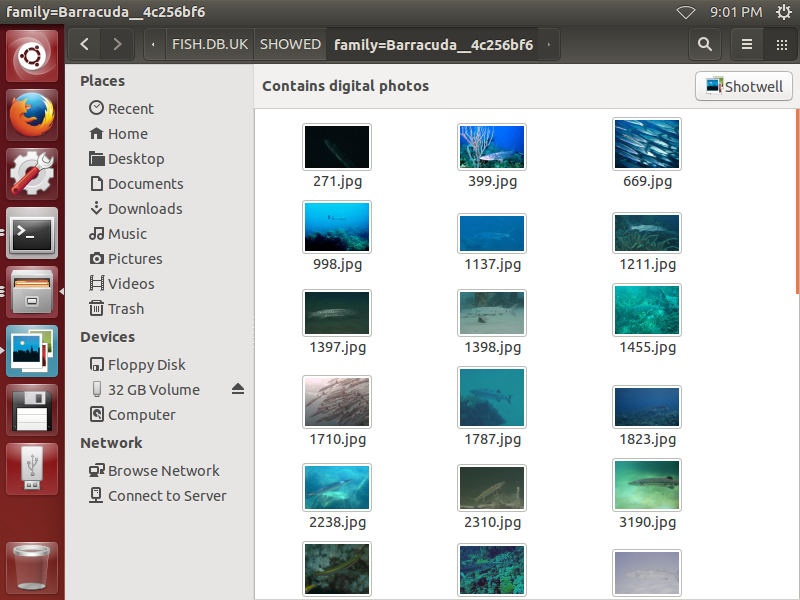

# FISHDB.CO.UK
this is a search helper for website http://www.fishdb.co.uk

## USAGE:
1. loose mode:  
--------------  

    python3 search.py -mode loose  "angel|Angel"
    python3 search.py -mode loose  "arcuatus|Arcuatus"
    
2. exact mode:  
--------------  

    python3 search.py -mode exact -family Barracuda
    
    all  slash keywords for exact mode:
      -sea
      -com-name
      -contributor
      -image-url
      -info-dir
      -rating
      -town
      -sci-name
      -desc
      -image-type
      -family
      -site
      -sub-site
      -country
      -image-dir
      -picid
      -referer-url
      -length
      -sci-family
      -pic-url

3. results:  
-----------  

    #ls -l SHOWED
    total 96
    drwx------ 2 root root 32768 Jun  8 20:13 angel_or_Angel__b1534b3d
    drwx------ 2 root root 32768 Jun  8 20:15 arcuatus_or_Arcuatus__fbf80cea
    drwx------ 2 root root 32768 Jun  8 20:33 family=Barracuda__4c256bf6
    #

4. creat selected photos dir:  
-----------------------------  

    python3 search.py -mode loose  "angel|Angel"
    python3 search.py -mode loose  "arcuatus|Arcuatus"
    python3 search.py -mode exact -family Barracuda
    python3 search.py -mode exact -family "Parrotfish"
    python3 search.py -mode loose "triggerfish|Triggerfish"
    python3 search.py -mode loose "Damselfish"
    python3 search.py -mode loose "Butterfly|butterfly"
    python3 search.py -mode loose "Bream|bream"
    python3 search.py -mode loose "Filefish|filefish"

 
 
 

5. show information of fish photo:
----------------------------------  

    python3 show.py -picid 14  
    
 
 
 
